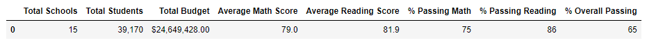
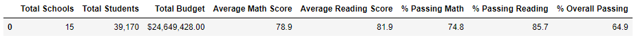
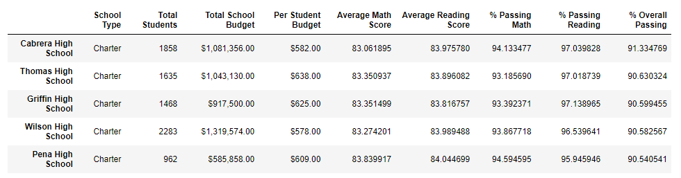
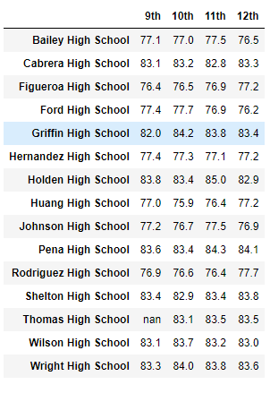
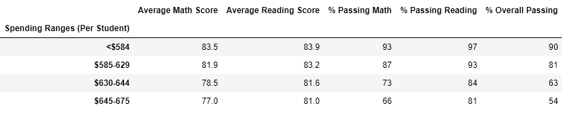
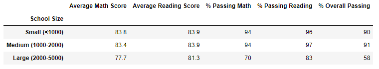

# School District Analysis
## Overview
The school district analysis project was performed to analyse and provide the following results to the school districts
- A snapshot of the district's overall performance
  - Total Budget, Average math scores, Average Reading Scores and Overall Scores
- A snapshot of each school's performance across the same parameters
- Top 5 and bottom 5 performing schools in the school district
- Average math and reading scores across different grade levels
- Performance based on per-capita budget
- Performance based on school type
- Performance based on school size

**The key area of importance in this challenge in the Thomas High School, where fraudulent data was discovered and we had to clean and re-analyse the data to arrive at conclusions.**  

## Environment

Jupyter Notebook
Dependencies
- Pandas
- Numpy

Resources
schools_complete.csv
students_complete.csv  

Key code snippet to replace Thomas High School values with Nulls  

``` python
student_data_df.loc[(student_data_df["school_name"] == "Thomas High School") & (student_data_df["grade"] == "9th") 
                    & (student_data_df["reading_score"] >0),"reading_score" ] = np.nan
```

## Impact of the removal of Thomas High School 9th grade scores
### How is the district summary affected?
Overall the district summary scores are marginally lowered by the removal of Thomas High School 9th grade scores
_Old scores_  
  

_New scores_  
  

### How is the school summary affected?
As far as the school summary is concerned, only the summary for the Thomas High School is affected, however from a relative position it still remains at the 2nd position in school rankings

_new school rankings_  


### How does replacing the ninth-grade scores affect the following:
**Math and reading scores by grade**  
The value for the 9th grade math and reading scores for Thomas High School were replaced by Nulls as seen in the below image  

_new school scores_
  

**Scores by school spending** 

Contrary to intuitive belief, lower spending per capita actually increases student performance as indicated in the below image  

  

**Scores by school size**  

However smaller school sizes perform better



**Scores by school type**

Charter schools perform much better than district schools as well


